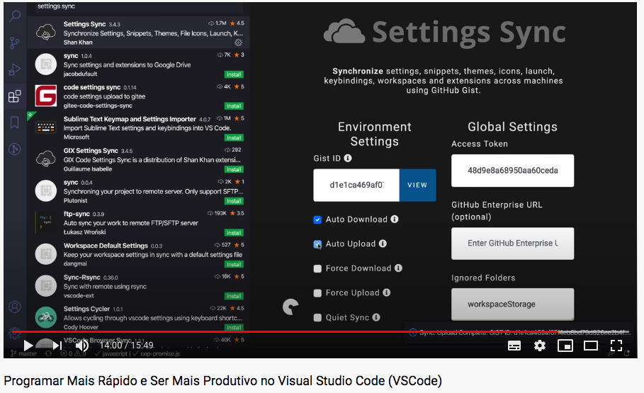

## Plugins vs code 

| Plugin | Descrição |
| :-------------: |:-------------|
| Dracula Official | Thema |
| Color Highlight | Mostrar cores hexadecimal #7159c1 |
| DotENV | Cria syntax highlighting para arquivos .env |
| EditorConfig | Padroniza dos editores , Encod, quebra de linha etc (cria um arquivo .editorconfig padrão) |
| Live Server | deploy automático de css e html |
| * Live Share | compartilhamento de tela/código |
| ESLint | Validador de código JavaScrit |
| GitLens | Visualizar no código histórico de alteração|
| Material Icon Theme | icons estilizados
| Rocketseat react | conjunto de Snippets ou atalhos |
| Bracket Pair Colorizer | Identificação de (), {} e [] |
| Code Spell Checker | Corretor Ortográfico (instalar tbm Brazilian Portuguese - Code Spell Checker streetsidesoftware.code-spell-checker-portuguese-brazilian) **configurar** _show spell checker Configuration Info_ |
| REST Client| Client Rest pra substituir Postman |
| Power Mode | Firula pra escrever |
| Import Cost | Tamanho dos arquivos importados |
| WakaTime | Monitora tempo de trabalho |
| markdownlint | Ajuda hint |
| CSS Peek | Inspecionar css no html |
| Settings Sync | Sincronizar configurações no https://gist.github.com/fabioara/ |

#### Atalhos

Shift + Command + P (find config)
>Preferences: Open Keyboard Shortcuts

* add selection (renomear múltiplas variáveis)
* move line (mover uma linha)
* comment (comentário em bloco) [command + / ]
* Copy Line (duplicar linha)
* toggle integrated (abrir o terminal)